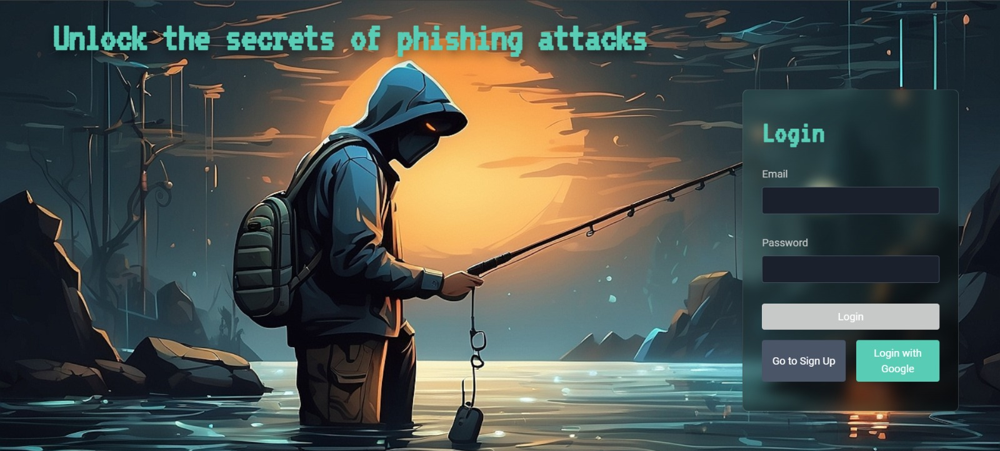
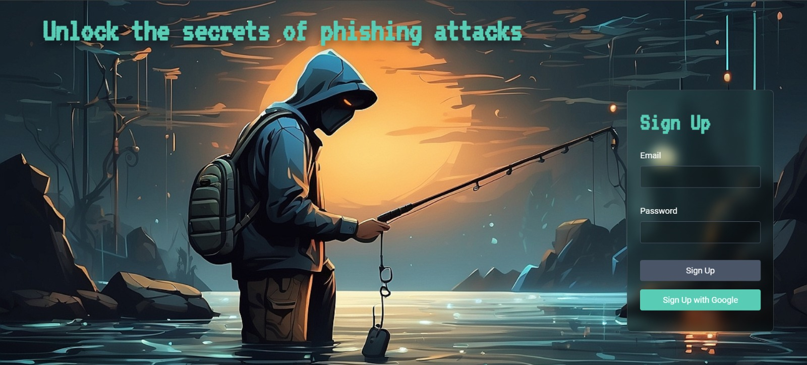

### PHISHING STIMULATOR

# Empower Your Team: Train, Test, and Secure with Our Phishing Simulator

Simulating sophisticated phishing attacks to enhance cybersecurity training and preparedness.

## The problem it solves

This application allows cybersecurity teams to conduct realistic phishing simulations, providing insights into potential vulnerabilities within an organization. By mimicking legitimate emails and launching sophisticated phishing campaigns, AI-PhishBot helps organizations train employees to recognize and respond to phishing attempts, ultimately improving overall security posture.

## Challanges we ran into

1. **Reconnaissance**: Gathers information to tailor phishing attacks.
2. **Profiling**: Creates detailed profiles of targets to enhance the realism of phishing attempts.
3. **Phishing Email Generation**: Crafts convincing phishing emails that mimic legitimate communication.
4. **Communication with Bots**: Manages interactions with targets and adjusts tactics based on responses.
5. **Success Metrics**: Measures the effectiveness of the campaign to identify areas for improvement.

## Video Link
 https://youtu.be/SfrPamDfGvM

## How to Use

1. **Setup**: Clone the repository and install necessary dependencies.
    ```sh
    npm install
    ```

2. **Login**: The login screen will appear as shown below. Enter your credentials or login via a Google Account:

   

2. **Signup Page**: IF you have not created an account, then move to the signup page page to create an account
   
   
   
3. **Dashboard Login**: Access the dashboard to view and manage campaigns and the history of the previous campaigns conducted and their records and also success and failure rates of the previous campaign.
   
   

4. **List of Active email addresses**: Through profiling and tools like [Hunter.IO](https://hunter.io/) we have created a list of active email addresses.

   
    
6. **Create New Campaign**: Go to the 'New Campaigns' section and write the campaign name and mention all the input the target domain name.

   

8. **View Campaigns**: Navigate to 'View Campaigns' to see the list of existing campaigns sorted by date. A dropdown of campaigns sorted by date will be displayed.

9. **Information Gathering**: Enter the target domain name to automatically gather active email addresses using tools like Google Dorking, Crawling Websites, Hunter.io, and APIs. Alternatively, upload a CSV file with email addresses.

10. **Email Verification**: Verify the gathered email addresses to ensure they are active. The verified list will be saved in the database.

11. **Profiling**: Select an email address from the list to gather detailed information using automated and manual profiling techniques.

12. **Phishing Email Generation**: Use the AI bot to generate and send phishing emails that mimic legitimate communication styles.

13. **Phishing Campaign Execution**: Track and document the success of the phishing campaign using metrics like email open rates and click rates.

14. **After clicking on the link**: You can't stop the urge to click and get hacked!
   

16. **AI Bot Communication**: Develop bots to respond to phishing emails and refine the campaign based on their responses.

## Technologies we used

<div style="display: flex; flex-wrap: wrap; gap: 10px;">
  <div style="border: 1px solid #ccc; padding: 10px; border-radius: 5px;">
   React JS
  </div>
  <div style="border: 1px solid #ccc; padding: 10px; border-radius: 5px;">
    Node JS
  </div>
  <div style="border: 1px solid #ccc; padding: 10px; border-radius: 5px;">
    Google Firebase
  </div>
  <div style="border: 1px solid #ccc; padding: 10px; border-radius: 5px;">
    Hunter.io API
  </div>
  <div style="border: 1px solid #ccc; padding: 10px; border-radius: 5px;">
    Gemini-1.5-flash API
  </div>
  <div style="border: 1px solid #ccc; padding: 10px; border-radius: 5px;">
    Tailwind CSS
  </div>
</div>


## Contact

For more information, please contact [harshitkandpal670@gmail.com](mailto:harshitkandpal670@gmail.com).

